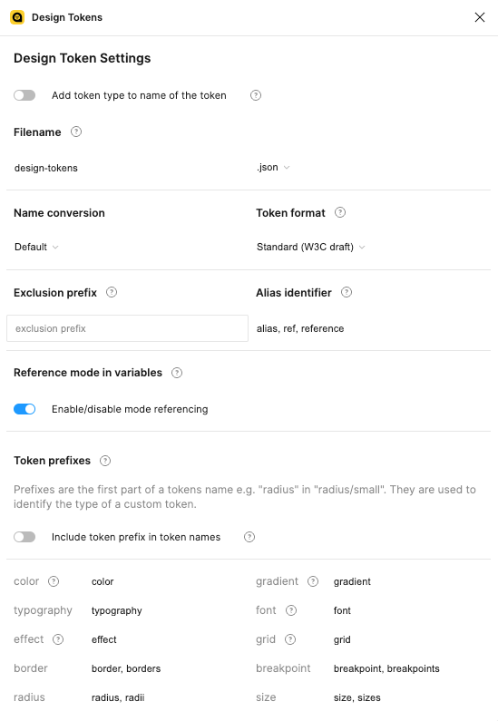
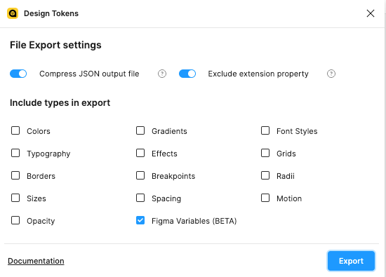

# Balena Design Tokens

## What's this?

Design tokens are small bits of design decisions that can be used across different platforms and projects. 
They define the visual language of a product, and help create a consistent experience across different platforms.

Practically, this package will serve two purposes:
* Be the source of truth for design decisions: instead of using absolute values in your project, you can import this package and reference tokens in a variety of ways (currently with an ES module and CSS custom properties).
* Add a layer of semantics: tokens are more descriptive and convey meaning. For example, instead of relying on abstract naming such as `primary.main` or `quartenary.lightest`, tokens convey meaning and context. Examples: `color.text.accent` or `color.bg.success.strong`.

## Usage

### Install the package in your project

`npm install @balena/design-tokens`

### TypeScript

```tsx
import tokens from '@balena/design-tokens';

console.log(tokens.color.text.accent.value); // outputs '#1496e1'
```

You can also import categories directly:

```tsx
import { color } from '@balena/design-tokens';

console.log(color.text.accent.value); // outputs '#1496e1'
```

### CSS

The file `@balena/design-tokens/build/css/tokens.css` contains all the tokens as CSS custom properties.

The way you would import this file depends on the project. In a typical `create-react-app` project (or similar)
you should be able to import it in a tsx file:

```tsx
import '@balena/design-tokens/build/css/tokens.css';
```

The custom properties will be added to the `:root` element, and you can use them anywhere like so:

```css
.alert.success {
	border: solid 1px var(--color-border-success);
	background-color: var(--color-bg-success);
	color: var(--color-text-success);
}
```

### Note

A JSON object containing all tokens with extra information is also available for documentation purposes.

## Update tokens

The tokens are exported from our Figma Design System library: https://www.figma.com/file/P7wVVPymUK4ekV6QOa3i0s/Design-System?type=design&t=hi4n82bo8vGO8noO-6

The export is a 3 steps process:
1. Download a JSON file using the [Design Tokens plugin](https://github.com/lukasoppermann/design-tokens) to export the tokens from Figma.
2. Replace the existing file in `tokens/design-tokens.json` with the one you downloaded 
3. (Optional) Run `npm run build` to generate the new tokens in the `build` folder
4. Create a new branch and open a PR with the changes

TODO: this process can be greatly improved by using the "Send Design Tokens to URL" feature of the plugin, which would 
allow for a more streamlined process.

### Plugin settings

Please replicate the settings exactly as shown in the screenshots below:




## Contribute

### How it works

This package uses [Style Dictionary](https://amzn.github.io/style-dictionary/#/) to generate the tokens. The tokens are defined in `tokens/design-tokens.json`, and the build process will generate the tokens in the `build` folder.

#### Install dependencies

```bash
npm install
```

#### Develop (watch the token folder)

```bash
npm start
```

#### Build the tokens

```bash
npm run build
```

#### Run the tests

```bash
npm run test
```

### Custom formats

See `scripts/transform.ts`.

Custom formats were created to generate the ES module and its typescript declarations, as standard formats didn't meet our
requirements:
* ES module export
* default exports to single categories for easier imports (`import { color } from '@balena/design-tokens'`)
* Path simplification (see below)

#### Path simplification

The goal of this package is to offer engineers the easiest way possible to implement design
decisions into their own projects. In this respect, we decided to shorten the path of the tokens as much as possible. So we don't use a "default" modifier, instead we 
reduce the path to the minimum:

❌ `color.bg.accent.default` \
✅ `color.bg.accent`

By using a `_` prefix, we can also easily filter out the default tokens from the Figma plugin in Style Dictionary CSS transform. But this is not available for JS objects, and that's the point of the `flattenDefaultTokens`.
